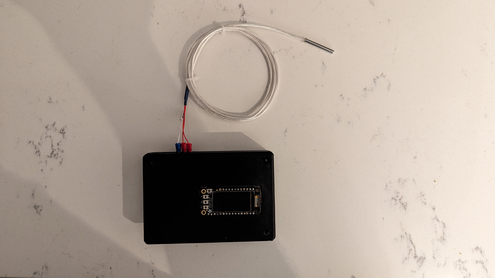

# RTD-Thermometer
Sreenivas Eadara

## Capabilities
This device can log temperatures down to .03125C using a PT100 probe and takes measurements every 110-120 ms. Measurements are streamed over USB serial (using the RP2040's USB-C port) and stored to a USB-A (plugged in to the USB Host port of the RP2040).

## Summary

This is a data logger built using the following parts from Adafruit:

Microcontroller: Feather RP2040 with USB Type A Host
https://www.adafruit.com/product/5723

Display: OLED FeatherWing
https://www.adafruit.com/product/4650

RTD Amplifier: MAX31865 PT100
https://www.adafruit.com/product/3328

RTD: 3 Wire PT100
https://www.adafruit.com/product/3290

PCB: Mint tin size Perma-Proto
https://www.adafruit.com/product/723

Using these parts just made it easier to finish the project (as opposed to spending time / revisions making my own modules), though there are plenty of other components that could work with modifications to the provided Arduino code.

Assembly involved wiring the MAX31865 to the default SPI pins on the RP2040 USB Host and stacking the OLED on the microcontroller through the perma-proto board. Note that depending on the PT100 probe used, traces may need to be cut and/or jumpers may need to be soldered on the MAX31865 breakout board. Please see Adafruit's instructions for this.

I designed a case to fit the device I built. If it helps, files (STEP and 3MF) are supplied with this repository. I powered the device using a LiPo battery from Adafruit so it could be used for a couple hours away from a charger (i.e. during experiments).

**See the LICENSE file in the CASE folder, which accompanies the STEP and 3MF files for the case, for information on the hardware copyright and licensing**

## Code
This code heavily uses examples and libraries from Adafruit's TinyUSB library and MAX31865 library (as well as the SH110X library for the display)!
It implements a state machine on Core 1 that controls the display and measures temperatures using the MAX31865, while Core 2 and the PIOs are responsible for USB host.

**See the LICENSE file in the FIRMWARE folder, which accompanies the code, for details on the code copyright and licensing.**

## Photos

